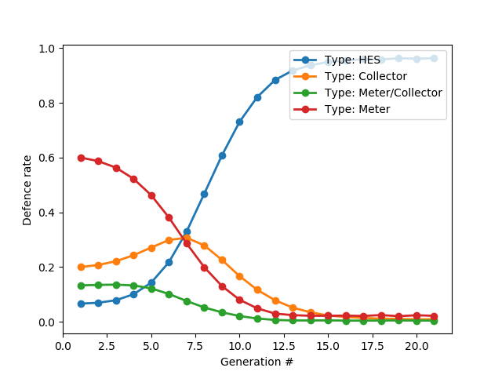

# Evolutionary game simulator for AMI:

Code for simulating a evolutionary game in an Advanced Metering Infrastructure. A population of defenders try to encrypt information using finite resources, while a polulation of attackers eavesdrop. 

Written by Peder Aursand, 2017.

## Dependencies:
- numpy
- pickle
- matplotlib

## How to run the test cases:

- Go to test case folder:

    cd case_study_1/

- Run case study:

    python case.py

- When finished, results are writte to text files. To plot results:

    python ../plot_results.py

This will generate illustrations of the population dynamics and save them as
pdf files in the case folder.

## How to design your own case:

- Copy the example case to a separate folder:
    cp -rf case_study_1/ <new_case_name>

- Edit the case file to define the AMI structure and node parameters:
    vim <new_case_name>/case.py
